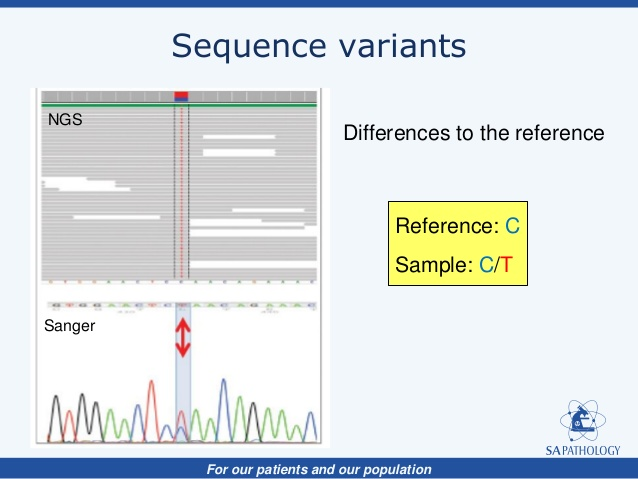
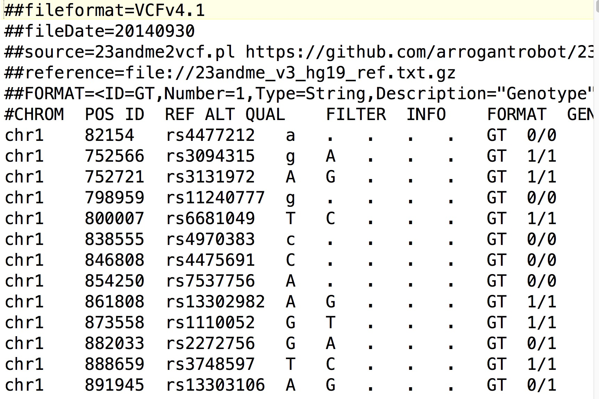

# Variant Calling

While sequence alignment is potentially the most important aspect of most NGS pipelines, in whole genome sequencing (WGS) experiments, such as the *C. elegans* data that we currently have, it is crucial to not only identify where reads have mapped, but regions in which they differ. These regions are called "sequence variants", and can take many forms. Three major types of sequence variation that occur in NGS data include:

1. Single Nucleotide Polymorphisms or Variants (SNPs/SNVs): single-base pair changes. e.g. A->G
2. Insertion-Deletions (InDels): An insertion or deletion of a region of genomic DNA. e.g. AATA->A
3. Structural Variants: These are large segments of the genome that have been inserted, deleted, rearranged or inverted within the genome.

NGS has enabled sequence variants to be identified at an extremely high resolution, due to the increase of sequence *coverage* i.e. the amount of times one base of DNA has been sequenced. When we say "a genome has been sequenced to 10x coverage", what we mean is that each individual base in the genome has been sequenced an average of 10 times. Compared to previous sequencing technologies such as Sanger, which sequenced an individual region of DNA once, it was incredibly difficult to identify sequence variants and involved a lot of erroneous calls.



Before we start calling variants we will need to sort the alignment.

```
samtools sort SRR2003569_chI.bam SRR2003569_chI.sorted
```

This helps the variant caller to run the calling algorithm efficiently and prevents additional time to be allocated to going back and forth along the genome. This is command for most NGS downstream programs, such as RNA gene quantification and ChIPseq peak calling.

---
**Note: Additional Filtering**
Ideally, before we start calling variants, there is a level of duplicate filtering that needs to be carried out to ensure accuracy of variant calling and allele frequencies. The definition of read duplicates can differ depending on which program you use, but usually it means 'a read in an alignment that has exactly the same start and end position'. The `samtools` documentation states "if multiple read pairs have identical external coordinates, only retain the pair with highest mapping quality". While this seems fine for a simple sequencing experiment, this method has drawbacks for large sequencing projects that may use multiple libraries etc. A more robust duplicate removal program such as [MarkDuplicates from Picard Tools](http://broadinstitute.github.io/picard/) is commonly used. Below is an example of what you usually need to run to filter duplicates

```
# Remove duplicates the samtools way
samtools rmdup [SORTED BAM] [SORTED RMDUP BAM]

# Remove duplicates the picard way (which uses Java)
java -jar /path/to/picard/tools/picard.jar MarkDuplicates I=[SORTED BAM] O=[SORTED RMDUP BAM] M=dups.metrics.txt REMOVE_DUPLICATES=true
```

In this tutorial, we will not remove duplicates.

---

## Variant callers

Variant callers work by counting all reference and alternative alleles at every individual site on the reference genome. Because there will be two alleles (e.g. A and B) for each individual reference base (assuming the organism that you are sampling is diploid), then there will be sites which are all reference (AA) or alternate (BB) alleles, which we call a homozygous site. If the number of sites is close to 50/50 reference and alternate alleles (AB), we have a heterozygous site.

There are many variant calling algorithms, which all have advantages and disadvantages in terms of selectivity and sensitivity. Many algorithms aim to detect *regions* of the genome where many variants have been called, rather than individual sites, and thus are called *haplotype callers*. The standard output of a variant caller is a *variant call format* (VCF) file, a tab-separated file which details information about every sequence variant within the alignment. It contains everything that you need to know about the sequence variant, the chromosome, position, reference and alternate alleles, the variant quality score and the genotype code (e.g. 0/0, 1/1, 0/1). Additionally, the VCF file can be annotated to include information on the region in which a variant was found, such as gene information, whether the variant had a ID (from major databases such as NCBI's dbSNP for example) or whether the variant changed an amino-acid codon or not (synonymous vs non-synonymous sequence variants).



Today we are going to use the haplotype-based caller `freebayes`, which is [a Bayesian genetic variant detector designed to find small polymorphisms, specifically SNPs (single-nucleotide polymorphisms), indels (insertions and deletions), MNPs (multi-nucleotide polymorphisms), and complex events (composite insertion and substitution events) smaller than the length of a short-read sequencing alignment](https://github.com/ekg/freebayes).

Time to run the variant calling. All we need is a reference genome sequence (fasta file), a index of the reference genome (we can do this using `samtools`), and our BAM alignment. Because variant calling takes a long time to complete, we will only call variants in the first 1Mb of *C. elegans* ChrI to save time. To enable us to subset the command, we also need to index the alignment file:

```
# Index the reference genome
samtools faidx chrI.fa

# Index the alignment file
samtools index SRR2003569_chI.sorted.bam

# Run freebayes to create VCF file
freebayes -f chrI.fa --region I:1-1000000 SRR2003569_chI.sorted.bam > SRR2003569_chI_1Mb.sorted.vcf
```

If you're interested in getting all variants from ChrI, run the command without the `--region I:1-5000000` parameter.

## Interpreting VCF

Ok, lets have a look at our VCF file. The first part of the file is called the header and it contains all information about the reference sequence, the command that was run, and an explanation of every bit of information that's contained within the *FORMAT* and *INFO* fields of each called variant. These lines are denoted by two hash symbols at the beginning of the line ("\#\#"). The last line before the start of the variant calls is different to most of the header, as it has one \# and contains the column names for the rest of the file. Because we did not specify a name for this sample, the genotype field (the last field of the column line) says "unknown".

```
##fileformat=VCFv4.2
##fileDate=20170924
##source=freeBayes v1.1.0-9-g09d4ecf
##reference=chrI.fa
##contig=<ID=I,length=15072434>
##phasing=none
##commandline="freebayes -f chrI.fa --region I:1-1000000 SRR2003569_chI.sorted.bam"
##INFO=<ID=NS,Number=1,Type=Integer,Description="Number of samples with data">
##INFO=<ID=DP,Number=1,Type=Integer,Description="Total read depth at the locus">
...
##FORMAT=<ID=MIN_DP,Number=1,Type=Integer,Description="Minimum depth in gVCF output block.">
#CHROM  POS     ID      REF     ALT     QUAL    FILTER  INFO    FORMAT  unknown
```

After the header comes the actual variant calls, starting from the start of the specified genomic region (in our case: ChrI Position 1bp).

```
#CHROM  POS     ID      REF     ALT     QUAL    FILTER  INFO    FORMAT  unknown
I       359     .       A       T       1.53071e-06     .       AB=0.205128;ABP=32.4644;AC=1;AF=0.5;AN=2;AO=8;CIGAR=1X;DP=39;DPB=39;DPRA=0;EPP=20.3821;EPPR=17.1973;GTI=0;LEN=1;MEANALT=2;MQM=21.5;MQMR=10.0667;NS=1;NUMALT=1;ODDS=14.8585;PAIRED=0.25;PAIREDR=0.566667;PAO=0;PQA=0;PQR=0;PRO=0;QA=297;QR=1097;RO=30;RPL=0;RPP=20.3821;RPPR=68.1545;RPR=8;RUN=1;SAF=8;SAP=20.3821;SAR=0;SRF=22;SRP=17.1973;SRR=8;TYPE=snp       GT:DP:AD:RO:QR:AO:QA:GL 0/1:39:30,8:30:1097:8:297:-2.627,0,-15.4132
I       384     .       A       T       11.6927 .       AB=0.303371;ABP=62.7868;AC=1;AF=0.5;AN=2;AO=54;CIGAR=1X;DP=178;DPB=178;DPRA=0;EPP=49.4959;EPPR=38.7602;GTI=0;LEN=1;MEANALT=2;MQM=21.2222;MQMR=10.4228;NS=1;NUMALT=1;ODDS=2.622;PAIRED=0.407407;PAIREDR=0.617886;PAO=0;PQA=0;PQR=0;PRO=0;QA=2002;QR=4545;RO=123;RPL=0;RPP=120.27;RPPR=261.486;RPR=54;RUN=1;SAF=44;SAP=49.4959;SAR=10;SRF=83;SRP=35.653;SRR=40;TYPE=snp   GT:DP:AD:RO:QR:AO:QA:GL 0/1:178:123,54:123:4545:54:2002:-38.3333,0,-56.9841
I       437     .       T       A       26.7335 .       AB=0.444444;ABP=3.25157;AC=1;AF=0.5;AN=2;AO=4;CIGAR=1X;DP=9;DPB=9;DPRA=0;EPP=5.18177;EPPR=13.8677;GTI=0;LEN=1;MEANALT=1;MQM=16.25;MQMR=11.4;NS=1;NUMALT=1;ODDS=6.15346;PAIRED=0.75;PAIREDR=0.4;PAO=0;PQA=0;PQR=0;PRO=0;QA=128;QR=161;RO=5;RPL=4;RPP=11.6962;RPPR=13.8677;RPR=0;RUN=1;SAF=3;SAP=5.18177;SAR=1;SRF=5;SRP=13.8677;SRR=0;TYPE=snp   GT:DP:AD:RO:QR:AO:QA:GL 0/1:9:5,4:5:161:4:128:-3.05744,0,-2.49224
```


### Questions

1. How many variants were called in region ChrI:1-1Mb?

2. The VCF file above shows three variants from the called VCF. What types of variants are they, and are they homozygous or heterozygous?

3. Which INFO field contains information about the variant allele-frequency?

## Filtering the VCF

While we seem to have called a lot of variants on chrI, have a look at the sequence that the chromosome starts off with:

```
head chrI.fa
```

What can you say about the sequence?

Just because a variant is called, does not mean that it is a true positive! Each variant called within the file holds a variant quality score (found in the *QUAL* field). [From the VCF format specifications](http://www.internationalgenome.org/wiki/Analysis/vcf4.0):

```
QUAL phred-scaled quality score for the assertion made in ALT. i.e. give -10log_10 prob(call in ALT is wrong). If ALT is ”.” (no variant) then this is -10log_10 p(variant), and if ALT is not ”.” this is -10log_10 p(no variant). High QUAL scores indicate high confidence calls. Although traditionally people use integer phred scores, this field is permitted to be a floating point to enable higher resolution for low confidence calls if desired. (Numeric)
```


To weed out the low confidence calls in our VCF file we need to filter by QUAL. This can be done using the `bcftools` program that's included within the `samtools` suite of tools. All these tools can run on gzip-compressed files which saves a lot of space on your computer.

```
gzip SRR2003569_chI_1Mb.sorted.bam.vcf
```

Ok lets filter by QUAL. We can do this with the `bcftools filter` or  `bcftools view` commands which allows you to run an expression filter. This means you can either exclude (`-e`) or include (`-i`) variants based on a certain criteria. In our case, lets exclude all variants that have a QUAL < 30.

```
bcftools filter -e 'QUAL < 30' SRR2003569_chI_1Mb.sorted.vcf.gz -Oz -o SRR2003569_chI_1Mb.sorted.q30.vcf.gz

# You can pipe to grep and wc to remove the header
#   and count your remaining variants after filtering too
bcftools filter -e 'QUAL < 30' SRR2003569_chI_1Mb.sorted.vcf.gz | grep -v "^#" | wc -l
```

How many variants greater than QUAL 30 do you have? How about the number of heterozygous variants that have a QUAL>30?

```
bcftools filter -i 'QUAL>30 && GT="0/1"' SRR2003569_chI_1Mb.sorted.vcf.gz
```

The `bcftools view` commands gives a lot of additional filtering options.


### Questions

1. Use the `bcftools view` or `bcftools filter` command to count the number of:
   a. SNPs
   b. homozygous variants

2. Depth is also a common filtering characteristic that many people use to remove low confidence variants. If you have low coverage of a variant, it lowers your ability to accurately call a heterozygotic site (especially if you are confident that you sequenced the sample the an adequate depth!). Find the number of SNPs that have a depth that is equal to or greater than 30 and a quality that is greater than 30.

## Genomic VCF

While we can identify variants easily, what happens with the other regions? Do we know that there is no variants in regions that are not called? What happens if there is low genome sequence coverage in those regions? How can we be sure that we are not identifying variants in those regions?

Using `freebayes` (and other haplotype/variant callers), we are able to create a *genomic* VCF or GVCF, which includes coverage information of the uncalled regions.

```
freebayes -f chrI.fa --region I:1-1000000 SRR2003569_chI.sorted.bam --gvcf > SRR2003569_chI_1Mb.sorted.gvcf
```

Lets have a look at the GVCF file and see how it differs from VCF

```
#CHROM  POS     ID      REF     ALT     QUAL    FILTER  INFO    FORMAT  unknown
I       2       .       C       <*>     0       .       DP=0;END=358;MIN_DP=0   GQ:DP:MIN_DP:QR:QA      6842.23:0:0:7068:225.773
I       359     .       A       T       1.53071e-06     .       AB=0.205128;ABP=32.4644;AC=1;AF=0.5;AN=2;AO=8;CIGAR=1X;DP=39;DPB=39;DPRA=0;EPP=20.3821;EPPR=17.1973;GTI=0;LEN=1;MEANALT=2;MQM=21.5;MQMR=10.0667;NS=1;NUMALT=1;ODDS=14.8585;PAIRED=0.25;PAIREDR=0.566667;PAO=0;PQA=0;PQR=0;PRO=0;QA=297;QR=1097;RO=30;RPL=0;RPP=20.3821;RPPR=68.1545;RPR=8;RUN=1;SAF=8;SAP=20.3821;SAR=0;SRF=22;SRP=17.1973;SRR=8;TYPE=snp       GT:DP:AD:RO:QR:AO:QA:GL 0/1:39:30,8:30:1097:8:297:-2.627,0,-15.4132
I       360     .       A       <*>     0       .       DP=104;END=383;MIN_DP=39        GQ:DP:MIN_DP:QR:QA      83975.4:104:39:87242:3266.63
I       384     .       A       T       11.6927 .       AB=0.303371;ABP=62.7868;AC=1;AF=0.5;AN=2;AO=54;CIGAR=1X;DP=178;DPB=178;DPRA=0;EPP=49.4959;EPPR=38.7602;GTI=0;LEN=1;MEANALT=2;MQM=21.2222;MQMR=10.4228;NS=1;NUMALT=1;ODDS=2.622;PAIRED=0.407407;PAIREDR=0.617886;PAO=0;PQA=0;PQR=0;PRO=0;QA=2002;QR=4545;RO=123;RPL=0;RPP=120.27;RPPR=261.486;RPR=54;RUN=1;SAF=44;SAP=49.4959;SAR=10;SRF=83;SRP=35.653;SRR=40;TYPE=snp   GT:DP:AD:RO:QR:AO:QA:GL 0/1:178:123,54:123:4545:54:2002:-38.3333,0,-56.9841
I       385     .       G       <*>     0       .       DP=280;END=436;MIN_DP=81        GQ:DP:MIN_DP:QR:QA      521301:280:81:529404:8103.11
```

The first called line shows that between Position 2 till Position 358, there was no coverage (depth == 0). Therefore no variant could be called in that region. However two lines later we see that there is a region from between Position 360 till 383 which has extremely good coverage (depth of 104 with a minimum depth of 39), meaning that we can be sure that we only find the reference allele in that block.

### Why are Genomic VCFs important?

In large scale human genomics or whole genome sequencing used to diagnose a patient in the clinic, it is important that you are sure that you are not only identifying high-quality variants, but that you are not missing potentially pathogenic sequence variants in those regions that are difficult to sample. Its also important to note that the human reference genome is not exactly ethnically diverse (most of the genome is sequenced from European Individuals), meaning that one population's reference allele could easily be an alternate allele in another. GVCFs enable the user to derive the maximum amount of genomics information as possible from the variant caller.

---
